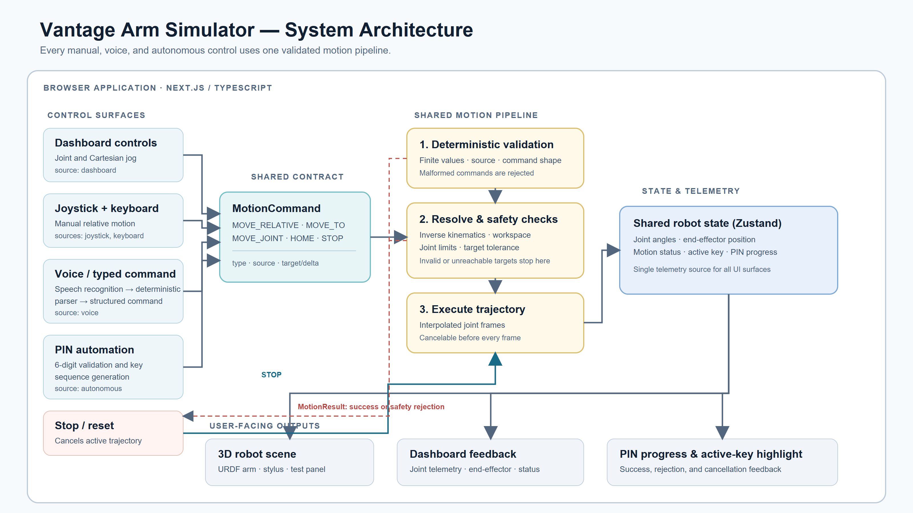
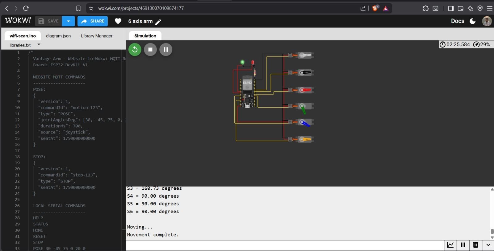

# Vantage Arm Simulator

Vantage Arm Simulator is a browser-based 3D control dashboard for a 6-DOF robotic arm interacting with a fixed six-key panel. It combines URDF visualization, shared robot state, safety-checked motion commands, multiple input methods, autonomous PIN entry, and optional agentic voice control in one demo-ready interface.

## Hackathon Submission

### The problem

Robotic-arm demonstrations often require separate tools for visualization, manual control, voice input, and task automation. That makes the system difficult to understand and unsafe to operate during a short live demo.

### Our solution

Vantage provides one operator dashboard where users can inspect the robot and panel in 3D, send Cartesian or joint commands, enter a PIN autonomously, and receive clear feedback about robot state and command results. Every movement is routed through the same validation and motion pipeline before the simulated arm moves.

### Demo highlights

- Interactive Three.js scene with the organizer-provided 6-DOF URDF.
- Six-key panel rendered at the trusted configuration coordinates.
- Cartesian joystick and keyboard jogging.
- Deterministic voice commands that work without an AI provider.
- Optional Groq-powered agentic voice mode for free-form and multi-step instructions.
- Autonomous PIN entry with hover, press, release, and retry behavior.
- Joint state, end-effector position, target position, source, status, and result telemetry.
- Emergency stop and cancellation support across motion and agentic execution.

## System Architecture



The main execution path is:

```text
User input
  -> Structured command API
  -> Safety validation
  -> Inverse kinematics
  -> Motion controller
  -> Shared robot state
  -> Three.js visualization and dashboard
```

Agentic voice mode adds a server-side reasoning step before the structured command API. The model can interpret natural language, but it cannot directly move the robot, provide panel coordinates, or bypass validation.

## Hardware Circuit Diagram



The circuit reference shows the ESP32-based six-axis servo setup used for the hardware concept. A live Wokwi simulation is available here:

[Open the Wokwi circuit simulation](https://wokwi.com/projects/469130070109874177)

## Features

### 3D simulation

- Loads `public/robot/arm.urdf` in React Three Fiber.
- Displays the robot, base grid, six-key panel, target marker, and stylus marker together.
- Supports orbit, pan, and zoom controls.
- Animates matching URDF joints from the shared robot store.

### Robot control

- Cartesian jogging along X, Y, and Z.
- Keyboard jogging with emergency-stop access through Escape.
- Joint state display in degrees for operator readability.
- Editable target coordinates with explicit save.
- Home/reset behavior through the shared motion controller.

### Voice and automation

- Deterministic voice parsing for common commands.
- Browser speech recognition with audio transcription fallback when available.
- Optional Groq agentic mode for commands such as:

  - `Move left 2 centimeters, then press key 5 twice.`
  - `Nudge the tip toward the panel and tap key 2.`
  - `Rotate the base thirty degrees, then move up one centimeter.`

- Agentic plans are shown to the operator and require explicit confirmation before execution.
- Ambiguous instructions produce a clarification question instead of an automatic movement.
- Spoken feedback is optional and never blocks motion execution.
- Autonomous PIN automation uses trusted key coordinates and executes each key press sequentially.

### Safety

- Workspace-bound validation for Cartesian targets.
- URDF joint-limit validation for joint commands.
- Finite-value and input-shape validation.
- Strict action allowlist for agentic plans.
- Trusted panel-key planning from `public/robot/key.config.json`.
- Immediate stop after a failed action.
- Emergency stop and cancellation of pending agentic requests.
- No execution before the operator confirms an agentic plan.

## Robot and Panel Configuration

The organizer-provided configuration uses:

| Property | Value |
| --- | --- |
| Robot | 6-DOF arm |
| Coordinate frame | `base_link` |
| Position units | meters |
| Panel approach axis | `-z` |
| Panel keys | `1` through `6` |
| Joint names | `joint_1` through `joint_6`, `stylus_pitch` |
| End-effector links | `stylus`, `stylus_tip` |

The panel key positions are loaded from `public/robot/key.config.json`; they are not generated by the language model.

## Tech Stack

- Next.js App Router and TypeScript
- React and Tailwind CSS
- Three.js, React Three Fiber, and Drei
- `urdf-loader` for robot visualization
- Zustand for shared robot state
- Groq for optional agentic interpretation
- Browser Speech Recognition and Speech Synthesis when supported

## Quick Start

### Requirements

- Node.js 20 or newer
- npm

### Install and run

```bash
npm install
npm run dev
```

Open [http://localhost:3000](http://localhost:3000).

### Optional agentic voice configuration

Create `.env.local` in the project root. Keep it local and never commit it:

```text
GROQ_API_KEY=your_groq_api_key
GROQ_MODEL=your_groq_model
```

The API key is used only by the server route at `/api/agent/interpret`. It is never exposed as a public environment variable or sent directly from the browser to Groq. Deterministic voice mode and typed commands remain available without these variables.

## Verification

```bash
npm run lint
npx tsc --noEmit
npm run build
```

The live demo should verify:

1. The URDF arm and six-key panel are visible in the same scene.
2. Orbit controls work and the dashboard reflects live robot state.
3. Cartesian, keyboard, voice, and PIN commands update the visualization.
4. Agentic plans show an interpretation and require confirmation.
5. Ambiguous instructions request clarification.
6. Failed actions stop the remaining plan and report the controller reason.
7. Emergency stop cancels active motion and pending agentic requests.

## Project Structure

```text
src/app/                         Next.js page and server routes
src/components/robot/            URDF scene, panel, markers, and robot UI
src/components/dashboard/        Telemetry panels and status display
src/components/controls/         Joystick, keyboard, voice, PIN, and stop controls
src/hooks/                       Control and interaction hooks
src/lib/robot/                   Kinematics, motion, safety, and URDF helpers
src/lib/agent/                   Agent schema, prompt, planner, and executor
src/lib/pin/                     PIN sequencing and trusted panel planning
src/store/                       Shared Zustand robot state
public/robot/                    Runtime URDF and panel configuration
hardware/                        Hardware-facing project materials
presentation/                    Hackathon presentation assets
system-architecture.png          Submission architecture diagram
circuit_diagram.jpeg              Hardware circuit diagram
```

## Scope and Limitations

This submission is a safe browser simulation and demonstration layer. It does not directly drive physical hardware. Speech recognition and speech synthesis depend on browser support; typed commands and deterministic controls provide the reliable fallback path. The optional Groq mode requires a valid server-side API configuration and network access.

## Team

Built as a four-person hackathon project covering visualization, motion and safety, controls and automation, and hardware architecture.
